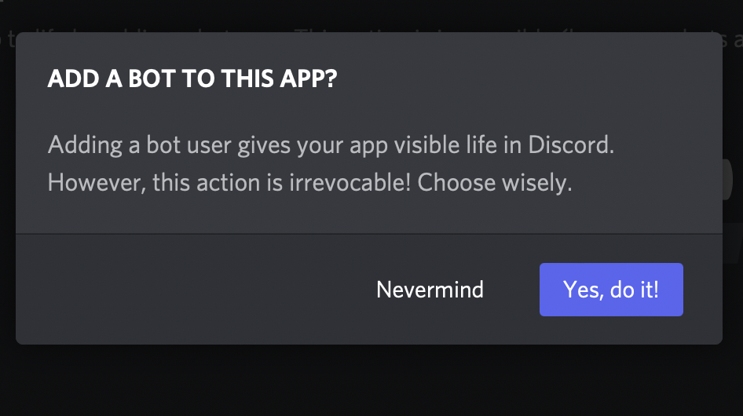
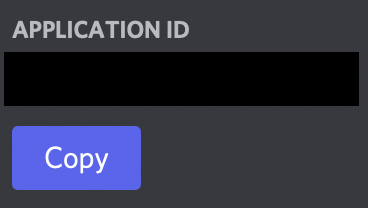

# Get started (Setting up the bot in Discord)

## Set up a bot account in Discord Developer Portal.
1. Go to [Discord Developer Portal](https://discord.com/developers).
2. In the Developer Portal page, select **New Application**.

   
3. Name the application and choose **Create**.

   
4. Select **Bot**.

   
5. Choose **Add bot**.

   
6. Choose **Yes, do it!**

   
7. Give your bot a name and an avatar (or just leave it as is).

   
8. Select the **Copy** button near the **Click to Reveal Token** link and paste it somewhere safe, we will need it for the next part.

## Invite the bot to your server.
1. Go to **General Information**.

   
2. Scroll down until you see your **Application ID**.

   
3. Paste `https://discord.com/api/oauth2/authorize?client_id=[CLIENT ID]&permissions=378225675264&scope=bot%20applications.commands`, replacing `[CLIENT ID]` with the Application ID you got from the previous step.
4. Select the server you want to invite the bot to and select **Continue**.

   
5. Scroll down until you see **Authorize** and press that button.

   
6. Complete the CAPTCHA challenge and you have invited the bot to your server.

[Move on to run the bot](./running.md)
